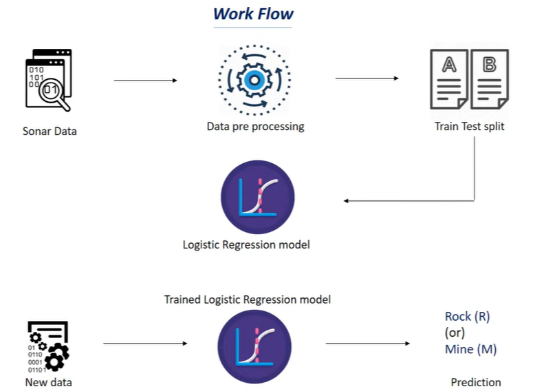

# Rock vs Mine Prediction

This repository contains a machine learning project that uses a logistic regression model to classify sonar signals as either rocks or mines.

## Workflow

The workflow of this project is illustrated in the diagram below:

1. **Sonar Data**: The raw data consisting of sonar signals is loaded.
2. **Data Preprocessing**: The data is preprocessed to handle missing values, normalize features, and prepare for model training.
3. **Train Test Split**: The dataset is split into training and testing sets.
4. **Logistic Regression Model**: A logistic regression model is trained using the training data.
5. **Trained Logistic Regression Model**: The trained model is used to make predictions on new data.
6. **Prediction**: The model predicts whether the sonar signal is a rock (R) or a mine (M).

**Model Performance**
The model achieved an accuracy of 0.7619047619047619 on the testing set.
